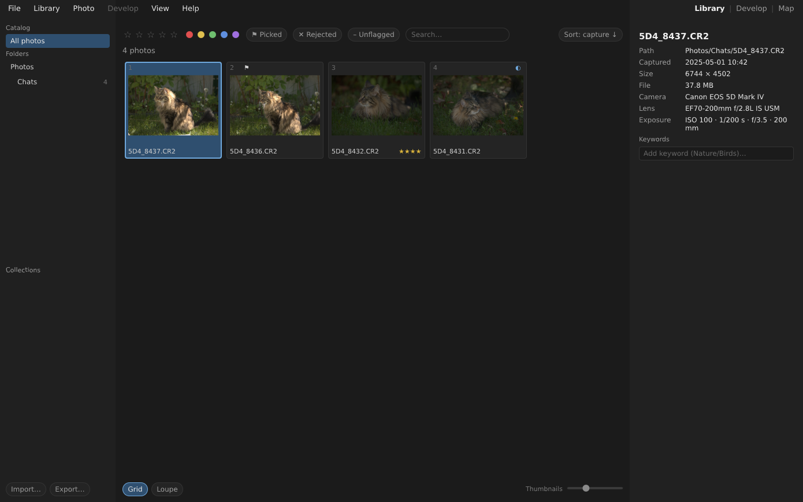
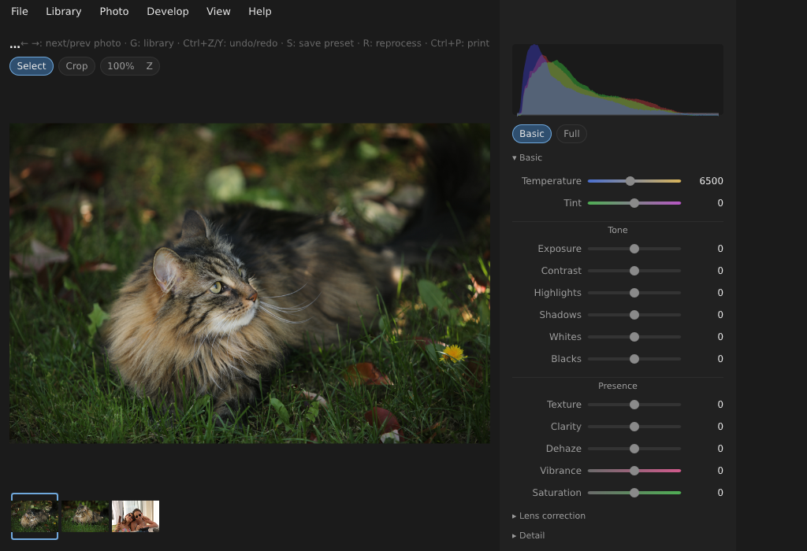

# Leyline


> **Open Source RAW Development Platform** — *Fast. Local. Open.*

Leyline develops RAW photographs and keeps a catalog of them. It runs entirely
on your machine: no account, no cloud, no subscription, no telemetry. Your
photos stay where you put them, and the catalog holds only references, metadata
and edit settings — never the images themselves.





## The promise the others don't make

Every edit is stored as parameters, never baked into pixels. That much is
ordinary — every RAW developer does it. What is not ordinary is **what those
parameters are guaranteed to mean later**.

Each stage of the render pipeline is versioned, and a published version is
frozen: its code is never edited again, only superseded by a new version that
new edits pin instead. A photo edited today records exactly which versions
rendered it, so the same file and the same settings produce **the same pixels
in ten years**, whatever the application has become in between. The contract is
written down, including where it stops
([`docs/pipeline.md`](docs/pipeline.md) §5), and it is enforced mechanically by
reference renders that fail the build if a single frozen pixel moves.

That is the answer to two problems photographers actually report: a subscription
that holds your work hostage, and a free tool whose results change under you
between releases.

## What it does

* **Catalog** — import (copy or reference in place), folders, collections and
  smart collections, keywords, ratings/flags/labels, search, an offline GPS map,
  tethered capture over USB, watched folders.
* **Develop** — white balance, tone, presence (clarity/texture/dehaze), tone
  curve, HSL mixer, color grading, spot removal, masked local adjustments
  (brush, radial, gradient, whole-image) refined by luminance and hue range,
  edge-preserving denoise, sharpening, lens correction (distortion, vignetting,
  chromatic aberration), DCP camera profiles, creative `.cube` LUTs, clipped
  highlight reconstruction, perspective correction, rotation and crop.
* **Output** — JPEG, PNG, TIFF, WebP and AVIF, with optional text watermark;
  a print module with paper sizes, margins and destination profiles; screen
  soft-proofing through an ICC profile.
* **Three clients, one engine** — a desktop application (Leyline Studio), a
  command-line tool, and a Rust SDK. Everything Studio does, the CLI does too,
  because they call the same API.

## Status — not released yet

There is **no packaged download**. The V1 scope is implemented and the test
suite is green, but nothing has been published, no version number has been cut,
and the documentation is in French. Building from source is the only way to run
it today.

## Build from source

Two system libraries are needed — **LibRaw** (RAW decoding) and **libgphoto2**
(USB tethering) — plus **nasm**, which the AVIF encoder's build requires. The
other bricks come with the crates: the Lensfun optics database is bundled, and
LittleCMS is built from source.

```bash
sudo apt install libraw-dev libgphoto2-dev nasm
```

Rust is pinned to an exact toolchain in `rust-toolchain.toml` — rendering
depends on it (see `docs/pipeline.md` §5.2), so `rustup` will pick the right one
by itself.

```bash
make check   # fmt + clippy + tests: the pre-commit gate
make run     # launch Leyline Studio
make cli ARGS="--help"
```

`make` on its own lists every target, including the packaging ones
(`appimage`, `windows`, `dmg`).

## Documentation

The full documentation lives in [`docs/`](docs/readme.md) **and is written in
French**. Start with [`docs/readme.md`](docs/readme.md), which gives a reading
order. The two documents worth knowing about:

* [`docs/vision.md`](docs/vision.md) — why the project exists, and what it
  refuses to be.
* [`docs/pipeline.md`](docs/pipeline.md) — the render pipeline, and §5, the
  reproducibility contract.

Every structural decision is an [Architecture Decision Record](docs/adr/), from
the choice of Rust to the way a creative LUT is applied. The project's rule is
older than its code:

> **No code before architecture. No architecture before vision.**

## Contributing

Start with [`CONTRIBUTING.md`](CONTRIBUTING.md), then
[`docs/contributing.md`](docs/contributing.md) for the full guide — in
particular the section on render stages, which is the most constrained
contribution in the project because it touches the promise above.
Contributions require signing the [CLA](CLA.md).

## License

[GPL-3.0-only](LICENSE), with one [additional permission under section
7](LICENSE-EXCEPTION.md) allowing Leyline to be combined with software under
other terms — every part of Leyline itself stays GPL-3.0, and the permission
does not survive modification. "Leyline" and the Leyline logo are subject to
[trademark terms](TRADEMARK.md). Third-party works bundled or linked into the
binaries are listed in [`THIRD-PARTY-NOTICES.md`](THIRD-PARTY-NOTICES.md).
