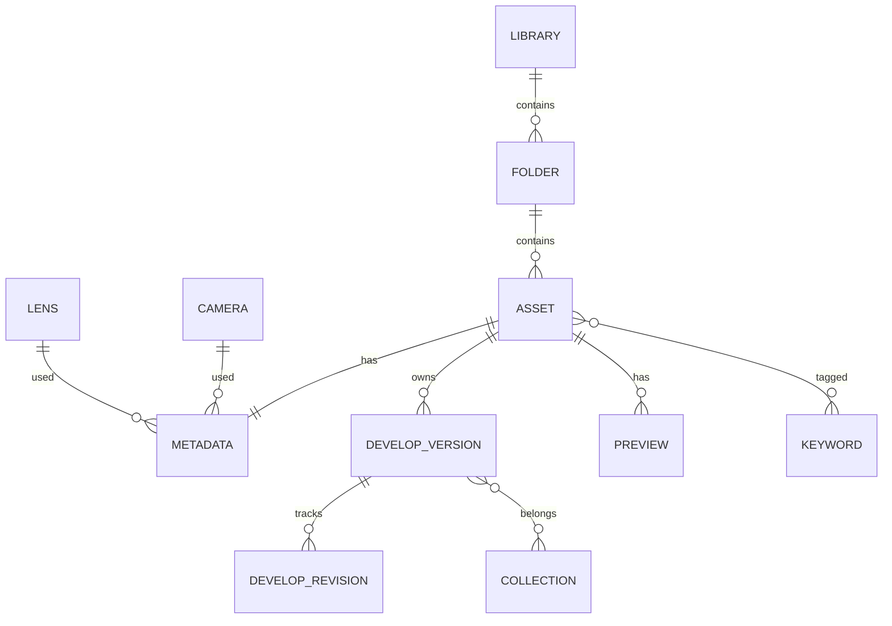

# Catalog Schema Specification

**Document:** `docs/catalog.md`
**Version:** 2.3
**Status:** Draft

---

# 1. Purpose

The catalog is the heart of Leyline.

It **never** stores the photographs.

It stores only:

* the references to the files;
* the metadata;
* the classification information;
* the develop settings;
* the collections;
* the keywords;
* the develop history;
* the information needed for searching.

The RAW engine stays entirely independent of the catalog.

---

# 2. Design Principles

## 2.1 Local First

The catalog works entirely offline.

A library is self-contained.

---

## 2.2 Non-destructive

RAW files are never modified.

Every operation is recorded in the catalog.

---

## 2.3 Relative Paths

No absolute path is ever recorded.

Every reference is relative to the library root.

Example:

```
Library/

    catalog.db

    Photos/

        Wildlife/

            IMG_0001.CR3
```

The catalog stores:

```
Photos/Wildlife/IMG_0001.CR3
```

Never:

```
C:\Users\...

/home/quentin/...
```

That rule guarantees portability between Windows, Linux and macOS.

---

## 2.4 Source of Truth

The SQLite catalog is the only source of truth.

XMP files are optional exports; they may **seed** an empty catalog at import but have authority over nothing (§29, [ADR 0047](adr/0047-xmp-sidecar-read.md)).

---

# 3. Physical Layout

```
Library/

│

├── catalog.db

├── Photos/

├── Cache/

│      ├── previews/

│      ├── thumbnails/

│      └── histograms/

├── Masks/                (stored mask coverages, ADR 0070 —
│                          16-bit grey PNG, named by their BLAKE3)

├── Profiles/

│      └── Camera/          (imported DCP profiles, ADR 0035)

├── Exports/

└── Backups/
```

Previews, histograms and thumbnails are never stored in SQLite.

SQLite holds only their metadata.

---

# 4. High Level Model



---

# 5. Entity Overview

The model rests on one central notion:

**Asset**

An Asset represents a file managed by Leyline.

Today:

* RAW
* JPEG
* TIFF
* PNG
* DNG
* HEIF

Tomorrow:

* PSD
* OpenEXR
* future formats

The catalog is therefore not limited to RAW files.

---

# 6. Database Configuration

Every SQLite connection must apply:

```sql
PRAGMA foreign_keys = ON;

PRAGMA journal_mode = WAL;

PRAGMA synchronous = NORMAL;

PRAGMA temp_store = MEMORY;

PRAGMA cache_size = -65536;
```

The schema is versioned through:

```sql
PRAGMA user_version;
```

The catalog's version number is never stored in a table.

SQLite already provides that mechanism.

---

# 7. Library

A single row.

```sql
CREATE TABLE library (

    id INTEGER PRIMARY KEY,

    uuid TEXT NOT NULL UNIQUE,

    name TEXT NOT NULL,

    created_at INTEGER NOT NULL,

    updated_at INTEGER NOT NULL

);
```

Dates are expressed in:

* UTC
* Unix Epoch
* milliseconds

The one exception: `capture_date`, whose semantics are given in §9 — EXIF does not always state the time zone of the shot.

---

# 8. Folders

```sql
CREATE TABLE folders (

    id INTEGER PRIMARY KEY,

    parent_id INTEGER NULL,

    relative_path TEXT NOT NULL UNIQUE,

    created_at INTEGER NOT NULL,

    FOREIGN KEY(parent_id)

        REFERENCES folders(id)

        ON DELETE RESTRICT

);
```

Folders represent the physical tree and nothing else.

They hold no business information.

---

# 9. Assets

The main table.

```sql
CREATE TABLE assets (

    id INTEGER PRIMARY KEY,

    uuid TEXT NOT NULL UNIQUE,

    folder_id INTEGER NOT NULL,

    filename TEXT NOT NULL,

    extension TEXT NOT NULL,

    media_type INTEGER NOT NULL,

    file_size INTEGER NOT NULL,

    checksum BLOB NOT NULL,

    width INTEGER,

    height INTEGER,

    capture_date INTEGER,

    capture_offset_minutes INTEGER,

    imported_at INTEGER NOT NULL,

    modified_at INTEGER NOT NULL,

    is_missing INTEGER NOT NULL DEFAULT 0,

    companion_of INTEGER NULL
        REFERENCES assets(id)
        ON DELETE CASCADE,

    UNIQUE(folder_id, filename),

    FOREIGN KEY(folder_id)

        REFERENCES folders(id)

        ON DELETE RESTRICT

);
```

## An asset's path

The full path is always derived:

```text
folders.relative_path + "/" + filename
```

No `relative_path` column exists in `assets`.

That makes any desynchronisation impossible when a folder is renamed or moved.

The `UNIQUE(folder_id, filename)` constraint guarantees that the same file cannot be referenced twice.

## Capture Date

EXIF (`DateTimeOriginal`) expresses a **local** time, often with no time zone.

Yet the photographer expects to find the wall-clock time of the shot, not a converted one.

The convention:

* `capture_offset_minutes` **known** (EXIF `OffsetTimeOriginal`, or GPS): `capture_date` holds the true UTC instant; display applies the offset to recover local time.
* `capture_offset_minutes` **NULL**: the EXIF wall-clock time is stored as is, interpreted as UTC. Display returns it without conversion.

That column has had a producer since [ADR 0056](adr/0056-non-raw-exif-import.md): importing a **non-RAW** file reads `OffsetTimeOriginal` where present and then fills both columns together. The RAW path supplies no offset and leaves the column NULL — the second case above.

**The trap on the RAW path, named because it was fallen into.** LibRaw parses the camera's naive `DateTimeOriginal` with `mktime`, which interprets it in the time zone of the machine doing the import. Taken as it comes, the same file dates two hours apart in Paris and eleven in Tokyo, the displayed time is no longer the one on the body, and a library stops carrying the same value everywhere. `leyline-raw` therefore **undoes** that interpretation before handing the value over: it breaks the timestamp back down in the zone that built it and reassembles those fields as UTC, which cancels the zone rules exactly, daylight saving on the day of the shot included.

The consequence is worth stating because it is not local: a RAW and the JPEG shot with it are only ever the same instant if both readers agree on this convention, and the pairing criterion below compares that instant to the second. A divergence there does not report an error — it silently pairs nothing.

In both cases:

* chronological sorting uses `capture_date` directly;
* the displayed time always matches what the photographer saw on their camera;
* if an offset becomes known after the fact (manual correction, GPS), the update is lossless.

## An asset is purely factual

The `assets` table holds nothing but facts about the file: path, size, checksum, dimensions, dates.

Classification (rating, label, pick) belongs to the **develop versions** (§18).

## RAW + JPEG: a companion file

A camera set to RAW+JPEG writes **two files for one shot**. `companion_of` says which one is the rendering of the other: `NULL` — by far the most frequent case — means the asset is itself a photo; a value designates the **master**, always the RAW.

Two files form a pair if all three terms hold ([ADR 0079](adr/0079-raw-jpeg-pairing.md) §2): the same filename stem (case-insensitive), the same `capture_date`, the same camera — **at any depth in the library**, the two files not necessarily being in the same folder. A file with no `capture_date` never pairs.

Three invariants:

* the master is a RAW and the companion is not — two RAW files of the same shot do not pair, neither being the rendering of the other;
* a companion is never a master in turn: `companion_of` always points at a row whose `companion_of` is `NULL`, so no chain forms;
* a master may carry **several** companions (a JPEG and a HEIF of the same shot).

The grid displays only masters — one `AND a.companion_of IS NULL` clause, in a single place, from which counting, filters, search and collections all derive. A companion keeps its row, its versions, its revisions and its classification: it leaves the grid, it does not leave the catalog, and `unpair` brings it back intact.

Migration v3 **adds the column without pairing anything**: an existing library goes on displaying everything until the retroactive pass is explicitly asked for (§7 of the ADR).

## Virtual versions

There is no `assets` row for virtual versions.

A virtual version is a **develop branch** (see §16).

An asset always represents one single physical file.

---

# 10. Asset Types

```text
0 RAW

1 JPEG

2 TIFF

3 PNG

4 DNG

5 HEIF

6 PSD

7 OTHER
```

---

# 11. Pick State

```text
0 None

1 Pick

2 Reject
```

Pick and Reject are carried by the **develop versions** (§18), like the rating and the label: every version is classified independently, in the manner of virtual copies elsewhere.

---

# 12. Checksums

Every checksum uses:

```
BLAKE3
```

Why?

* extremely fast
* cryptographically sound
* reference Rust implementation
* the best performance / security trade-off

The checksum covers the complete file.

`find_asset_by_checksum` answers the import's duplicate question, once per
candidate file. It reads `idx_assets_checksum` (§32): without that index the
lookup scans `assets` whole, and the cost of an import then grows with
everything already imported — 2,1 ms per file against 1,9 µs on a
50 000-asset library.

---

# 13. Metadata

Metadata is kept apart from assets so that the main table stays compact and optimised for frequent searches.

`gps_latitude`/`gps_longitude`/`gps_altitude` are populated at import for RAW files whose camera recorded a position (LibRaw `parsed_gps`, decimal degrees) — see `docs/adr/0040-gps-map-view.md` for the map view that consumes them (`Catalog::map_pins`). JPEG/TIFF files currently have no EXIF extraction at all (camera and lens included): the same pre-existing limit as the rest of this table, not a regression specific to GPS.

```sql
CREATE TABLE metadata (

    asset_id INTEGER PRIMARY KEY,

    camera_id INTEGER,

    lens_id INTEGER,

    orientation INTEGER,

    iso INTEGER,

    shutter_numerator INTEGER,

    shutter_denominator INTEGER,

    aperture_numerator INTEGER,

    aperture_denominator INTEGER,

    focal_length_numerator INTEGER,

    focal_length_denominator INTEGER,

    shutter_speed_s REAL GENERATED ALWAYS AS
        (CAST(shutter_numerator AS REAL) / shutter_denominator) STORED,

    aperture_f REAL GENERATED ALWAYS AS
        (CAST(aperture_numerator AS REAL) / aperture_denominator) STORED,

    focal_length_mm REAL GENERATED ALWAYS AS
        (CAST(focal_length_numerator AS REAL) / focal_length_denominator) STORED,

    exposure_bias REAL,

    flash INTEGER,

    white_balance_mode INTEGER,

    color_space TEXT,

    gps_latitude REAL,

    gps_longitude REAL,

    gps_altitude REAL,

    artist TEXT,

    copyright TEXT,

    FOREIGN KEY(asset_id)
        REFERENCES assets(id)
        ON DELETE CASCADE,

    FOREIGN KEY(camera_id)
        REFERENCES cameras(id)
        ON DELETE RESTRICT,

    FOREIGN KEY(lens_id)
        REFERENCES lenses(id)
        ON DELETE RESTRICT

);
```

---

## Why fractions?

EXIF generally stores:

* shutter speed
* aperture
* focal length

as rationals.

Example:

```text
1/3200

f/5.6

70/1
```

Storing those values directly avoids the precision losses that come with floating point.

The engine will convert them to `f64` later, when needed.

---

## Generated columns

The rationals are the reference, but they are unusable for range searches ("focal length between 24 and 70 mm").

The generated columns (`shutter_speed_s`, `aperture_f`, `focal_length_mm`) provide the decimal value, computed by SQLite itself (≥ 3.31), stored and indexable.

Denominators must be strictly positive; a missing rational leaves the generated column at `NULL`.

---

# 14. Cameras

```sql
CREATE TABLE cameras (

    id INTEGER PRIMARY KEY,

    manufacturer TEXT NOT NULL,

    model TEXT NOT NULL,

    UNIQUE(manufacturer, model)

);
```

---

# 15. Lenses

```sql
CREATE TABLE lenses (

    id INTEGER PRIMARY KEY,

    manufacturer TEXT NOT NULL,

    model TEXT NOT NULL,

    mount TEXT,

    UNIQUE(manufacturer, model)

);
```

---

# 16. Development Model

Settings are never overwritten.

The model is directly inspired by Git.

* A **revision** is a complete, immutable state of the settings (a commit).
* Revisions form a directed graph through `parent_revision_id`.
* A **version** is a branch: a name plus a pointer to a head revision.
* An asset's **current version** designates the active branch.

```text
RAW

↓

Revision 1 ── Revision 2 ── Revision 3      ← version "Default"
                    │
                    └────── Revision 4      ← version "Black & White"
```

That architecture gives:

* Undo for free: move the head pointer back;
* Redo for free: move it forward;
* A complete history: the revisions of a living asset are never deleted — that is what makes undo and snapshots trustworthy. Removing the asset itself from the catalog (ADR 0060) is not a rewriting of history and takes its revisions with it, through the schema's cascade;
* Snapshots: any revision can be named;
* **Virtual versions: simply a branch starting from an existing revision.**

No file duplication, no extra row in `assets`.

## The version is the library unit

The grid displays **versions**, not files.

Every version carries its own classification:

* rating;
* colour label;
* pick / reject;
* membership in collections.

Rating a "plain" photo amounts to rating its `Default` version.

**Keywords stay at the asset level**: they describe the content of the image, which is identical for every version (a heron in black and white is still a heron).

The dividing line is simple:

```text
A fact about the image     → asset      (keywords, EXIF, checksum)

A judgement about a render → version    (rating, label, pick, collections)
```

A known edge case: a crop can change the visible content (the person excluded from the frame). Should that need be confirmed, an additive `version_keywords` table will allow keywords to be added or hidden **per version**, without touching `asset_keywords` (see §38).

---

# 17. Develop Revisions

```sql
CREATE TABLE develop_revisions (

    id INTEGER PRIMARY KEY,

    asset_id INTEGER NOT NULL,

    parent_revision_id INTEGER,

    settings_json TEXT NOT NULL,

    author TEXT,

    created_at INTEGER NOT NULL,

    FOREIGN KEY(asset_id)
        REFERENCES assets(id)
        ON DELETE CASCADE,

    FOREIGN KEY(parent_revision_id)
        REFERENCES develop_revisions(id)
        ON DELETE RESTRICT

);
```

`author` is optional: it prepares for collaborative development (§38) at no cost today.

---

## Coalescing revisions

A revision represents a **user intention**, never an interface event.

Dragging a slider produces hundreds of events: it must produce **one single revision**.

### Commit points

The engine creates a revision only when:

* the user releases a control (end of drag);
* the user changes tool or setting;
* the user changes version or asset;
* an explicit action requires it (snapshot, export, XMP synchronisation).

Between two commit points, the intermediate values live in memory only, for the real-time preview.

### Amendment window

Successive adjustments of the **same setting** within a short window (2 seconds, configurable) amend the head revision instead of creating a new one.

Amending is permitted only if the head revision:

* has no child revision;
* is the head of no other version;
* is not the initial revision.

That is the **only exception** to the immutability of revisions, and it never concerns a revision referenced elsewhere.

An amendment invalidates the previews associated with that revision: their rows are deleted, and the cache is regenerated.

### Volume

No pruning is necessary: a revision weighs about 1 to 2 kB of JSON.

A heavily edited photo (50 revisions) costs less than 100 kB — negligible even across hundreds of thousands of assets.

Every row represents a complete state of the development.

The JSON is versioned independently so that it can evolve without an SQL migration.

Example:

```json
{
    "schema":1,
    "exposure":0.35,
    "contrast":12,
    "temperature":5400,
    "vibrance":18
}
```

The `schema` field corresponds to the version of the settings format, **not** to the number of modifications.

---

# 18. Versions and Current

## Versions (branches)

```sql
CREATE TABLE develop_versions (

    id INTEGER PRIMARY KEY,

    uuid TEXT NOT NULL UNIQUE,

    asset_id INTEGER NOT NULL,

    name TEXT NOT NULL,

    head_revision_id INTEGER NOT NULL,

    rating INTEGER NULL
        CHECK(rating BETWEEN 1 AND 5),

    color_label INTEGER NULL,

    pick_state INTEGER NOT NULL DEFAULT 0,

    created_at INTEGER NOT NULL,

    UNIQUE(asset_id, name),

    FOREIGN KEY(asset_id)
        REFERENCES assets(id)
        ON DELETE CASCADE,

    FOREIGN KEY(head_revision_id)
        REFERENCES develop_revisions(id)
        ON DELETE RESTRICT

);
```

* Editing = creating a revision, moving `head_revision_id` forward.
* Undo = moving `head_revision_id` back to the parent revision.
* Creating a virtual version = creating a row pointing at an existing revision.

The version carries the classification (`rating`, `color_label`, `pick_state`): every virtual copy is rated, labelled and flagged independently.

```text
rating :       NULL = unrated, 1 to 5 stars (the value 0 does not exist)

color_label :  NULL = no label
               0 Red, 1 Yellow, 2 Green, 3 Blue, 4 Purple
```

## Current version

```sql
CREATE TABLE develop_current (

    asset_id INTEGER PRIMARY KEY,

    version_id INTEGER NOT NULL,

    FOREIGN KEY(asset_id)
        REFERENCES assets(id)
        ON DELETE CASCADE,

    FOREIGN KEY(version_id)
        REFERENCES develop_versions(id)
        ON DELETE CASCADE

);
```

Switching version simply amounts to updating that reference.

## Initial revision

At import, the engine **necessarily** creates, for every asset:

1. an initial revision (neutral settings, `parent_revision_id = NULL`) — pinned like any stored revision (`pipeline.md` §3.3), therefore already carrying the `stages` map of a neutral revision. Those stage versions come from the engine, never from the catalog: `add_asset` receives the initial settings from its caller;
2. a default version (`Default`) pointing at that revision;
3. the corresponding `develop_current` entry.

An asset therefore **always** has at least one revision and one version.

That rule is indispensable: previews reference a revision (`NOT NULL`) — without an initial revision, no thumbnail could exist.

---

# 19. Previews

Previews are files stored on disk.

SQLite keeps only their metadata.

```sql
CREATE TABLE previews (

    id INTEGER PRIMARY KEY,

    asset_id INTEGER NOT NULL,

    revision_id INTEGER NOT NULL,

    kind INTEGER NOT NULL,

    width INTEGER NOT NULL,

    height INTEGER NOT NULL,

    relative_path TEXT NOT NULL,

    generated_at INTEGER NOT NULL,

    origin INTEGER NOT NULL DEFAULT 0,

    UNIQUE(asset_id, revision_id, kind),

    FOREIGN KEY(asset_id)
        REFERENCES assets(id)
        ON DELETE CASCADE,

    FOREIGN KEY(revision_id)
        REFERENCES develop_revisions(id)
        ON DELETE CASCADE

);
```

---

## Preview Kind

```text
0 Thumbnail

1 Small

2 Medium

3 Large

4 Full
```

Each level corresponds to a predefined maximum size.

---

## Preview Origin

```text
0 Rendered by the develop pipeline

1 The preview the file itself carried
```

An image the camera embedded in a RAW never went through the pipeline, so it
is not the render of any revision — recording it as one would make §20's
validity answer "yes" forever, and nothing would ever replace it. The column
keeps the two apart; `docs/adr/0082-embedded-preview-at-import.md` decides
when each is produced.

A render **replaces** an embedded preview in the same slot: same asset, same
revision, same kind, same file on disk, and `origin` flips to 0. That is why
the uniqueness constraint stays on three columns.

Example:

| Kind      | Max size          |
| --------- | ----------------- |
| Thumbnail | 256 px            |
| Small     | 1024 px           |
| Medium    | 2048 px           |
| Large     | 4096 px           |
| Full      | Native resolution |

---

# 20. Cache Invalidation

A preview is considered valid only if:

```text
preview.revision_id == head_revision_id of the current version
    AND preview.origin == 0
```

An undo that brings the head back onto an already previewed revision automatically revalidates the old previews: no regeneration is necessary.

The second term is §19's: a preview the file carried is displayable but is not the head's render, so it never answers this question. It is what a client draws while the render it also asked for is on its way.

In every other case:

* the preview is stale;
* it is regenerated automatically.

No extra timestamp or hash is necessary.

Comparing identifiers is enough.

## Retention

A preview that has become invalid is not deleted for all that: that is what makes the undo above free. But it does not survive indefinitely ([ADR 0075](adr/0075-preview-cache-retention.md)).

Kept, for one asset, are:

* the preview of **each version's head** — a virtual copy parked on an old revision keeps its own, whatever its age;
* those of the asset's **three most recent revisions**;
* the preview the **file itself carried** (§19), which belongs to the file rather than to a revision: it does not age with the history, and it goes when the asset does.

The rest is evicted — row and file — just after a new preview is recorded, the only moment at which the cache can exceed its window. No revision is deleted: what goes is a derived image, which the engine rebuilds in about a second.

Without that rule, a hundred edits of the same photo left a hundred previews, that is, more than the RAW itself.

---

# 21. Cache Layout

```text
Cache/

    previews/

        1/

        2/

        3/

    thumbnails/

    histograms/
```

The cache's physical organisation is independent of the catalog.

It can be deleted in full without data loss.

The engine will rebuild it automatically.

---

# 22. Keywords

Keywords are hierarchical from the very first version.

That avoids any complex migration later and allows the hierarchical organisation photographers already use elsewhere.

```sql
CREATE TABLE keywords (

    id INTEGER PRIMARY KEY,

    parent_id INTEGER,

    name TEXT NOT NULL,

    path TEXT NOT NULL UNIQUE,

    created_at INTEGER NOT NULL,

    FOREIGN KEY(parent_id)
        REFERENCES keywords(id)
        ON DELETE RESTRICT

);
```

---

## Example

```text
Nature
├── Birds
│   ├── Heron
│   ├── Eagle
│   └── Owl
└── Mammals
    ├── Fox
    └── Deer
```

In the database:

```text
Nature

Nature/Birds

Nature/Birds/Heron

Nature/Birds/Eagle

Nature/Mammals/Fox
```

The `path` field allows:

* fast searches;
* rebuilding the tree;
* simplified XMP export.

---

# 23. Asset Keywords

An N:N relation.

```sql
CREATE TABLE asset_keywords (

    asset_id INTEGER NOT NULL,

    keyword_id INTEGER NOT NULL,

    PRIMARY KEY(asset_id, keyword_id),

    FOREIGN KEY(asset_id)
        REFERENCES assets(id)
        ON DELETE CASCADE,

    FOREIGN KEY(keyword_id)
        REFERENCES keywords(id)
        ON DELETE RESTRICT

);
```

---

# 24. Collections

Collections are independent of the physical tree.

A collection contains **develop versions**: you put *the black & white version* into an album, and that is the one that displays and exports.

The same version may belong to several collections.

```sql
CREATE TABLE collections (

    id INTEGER PRIMARY KEY,

    uuid TEXT NOT NULL UNIQUE,

    parent_collection_id INTEGER,

    name TEXT NOT NULL,

    description TEXT,

    collection_type INTEGER NOT NULL,

    rules_json TEXT,

    created_at INTEGER NOT NULL,

    FOREIGN KEY(parent_collection_id)
        REFERENCES collections(id)
        ON DELETE RESTRICT

);
```

---

## Collection Types

```text
0 Manual

1 Smart
```

A manual collection contains an explicit list of assets.

A smart collection is generated automatically from rules.

---

## Renaming, moving, deleting

A collection is a filing device, not data: the three operations that manage it
**never** touch a version, a revision or a file.

* **Renaming** changes `name`, nothing else. An empty name is refused; names
  are not unique (two "Portraits" albums under two different parents are
  legitimate, and under the same parent it is the user's problem, not a
  catalog error).
* **Moving** changes `parent_collection_id` — the root being `NULL`. A move
  that would make a collection its own descendant is **refused**: the tree
  would stay coherent for SQLite, but the moved subtree would disappear from
  any reading that starts at the root.
* **Deleting** takes the **entire subtree** with it, from the bottom up — the
  `parent_collection_id` foreign key is `ON DELETE RESTRICT`, so a parent
  cannot leave before its children. Each deletion causes nothing but the
  disappearance of memberships (`collection_versions`, `ON DELETE CASCADE`),
  in accordance with the §29 invariant: *deleted collections cause only the
  deletion of relations, never of versions or assets*. The number of
  collections a delete order takes with it is known before it is executed, so
  that the interface can say so.

---

# 25. Collection Versions

```sql
CREATE TABLE collection_versions (

    collection_id INTEGER NOT NULL,

    version_id INTEGER NOT NULL,

    position INTEGER NOT NULL,

    PRIMARY KEY(collection_id, version_id),

    FOREIGN KEY(collection_id)
        REFERENCES collections(id)
        ON DELETE CASCADE,

    FOREIGN KEY(version_id)
        REFERENCES develop_versions(id)
        ON DELETE CASCADE

);
```

The `position` field preserves the order defined by the user.

---

# 26. Smart Collections

The criteria are stored as JSON.

Example:

```json
{
  "rating": {
    "gte": 4
  },
  "camera": "Canon EOS R5",
  "keywords": [
    "Nature/Birds"
  ],
  "pick": true
}
```

The engine then translates those rules into optimised SQL queries.

The JSON format is deliberately versionable.

---

# 27. Export Presets

```sql
CREATE TABLE export_presets (

    id INTEGER PRIMARY KEY,

    uuid TEXT NOT NULL UNIQUE,

    name TEXT NOT NULL,

    settings_json TEXT NOT NULL,

    created_at INTEGER NOT NULL

);
```

Presets are independent of the exports actually performed.

`settings_json` is opaque to the catalog; it is `leyline_export::ExportSettings` that interprets its structure: `format`, `quality` (1–100, ignored by lossless formats), `avif_speed` (1–10, the AVIF encoder's effort, 9 by default, ignored by every other format — [ADR 0067](adr/0067-avif-encode-speed.md)), `max_edge` (the longest edge, absent = actual size) and `watermark` ([ADR 0034](adr/0034-softproofing-watermark-print.md), [0051](adr/0051-watermark-rasterization-and-soft-proof-surface.md)). Unknown fields are refused: a preset written by a newer engine is never applied by halves.

---

# 28. Export History

```sql
CREATE TABLE export_history (

    id INTEGER PRIMARY KEY,

    asset_id INTEGER NOT NULL,

    preset_id INTEGER,

    format TEXT NOT NULL,

    destination TEXT NOT NULL,

    exported_at INTEGER NOT NULL,

    FOREIGN KEY(asset_id)
        REFERENCES assets(id)
        ON DELETE CASCADE,

    FOREIGN KEY(preset_id)
        REFERENCES export_presets(id)
        ON DELETE SET NULL

);
```

The history makes it possible to reproduce an export, or to identify quickly the last destination used.

---

# 29. XMP Sidecars

The catalog always remains the source of truth.

XMP files are optional.

Three modes will be offered:

```text
Never

On Demand

Always
```

## Never

No XMP file is generated.

All the information resides in the catalog alone.

## On Demand

The user explicitly triggers a synchronisation.

## Always

Every modification automatically commits the corresponding sidecar.

Those three modes concern **writing** only.

## Reading

The engine reads a sidecar to **seed** what the catalog does not yet have, never to arbitrate what it already has ([ADR 0047](adr/0047-xmp-sidecar-read.md)). The catalog therefore stays the only source of truth (§2.4): a sidecar has authority over no field already filled in, and nothing re-reads it afterwards.

Two moments, and only two:

* **at import**, automatically, if an `.xmp` sits next to the source file — this is the migration path from other software, the one that carries over years of ratings, labels and hierarchical keywords;
* **explicitly**, on an already imported asset (`read_xmp`), for a library built before the sidecars were exported.

The policy is to **fill without overwriting**: rating, label, artist and copyright are applied only where the catalog is empty, and keywords are a union. No read can remove or replace a catalog datum. There is no reading equivalent of the *Always* mode — that would be a second channel of authority, and so the end of §2.4.

The fields read are exactly those §29 above writes. Develop settings (Adobe's `crs:`) are **not** read: they are not translatable into our pipeline, and claiming to take them over would be lying about the render.

The sidecar's **name**, however, is not symmetric: Leyline writes `photo.xmp` (extension replaced, Adobe's convention) but also reads `photo.CR2.xmp` (the full name, the convention of darktable and exiftool), the second form being tried first because it designates one photo and one only ([ADR 0047](adr/0047-xmp-sidecar-read.md) §2.1).

The rest serves only interoperability with other software.

---

# 30. Search Philosophy

Every search must be executable directly by SQLite.

No external index is planned.

Searches must allow, among others:

* filename;
* capture date;
* camera;
* lens;
* ISO;
* focal length;
* aperture;
* shutter speed;
* rating;
* colour;
* Pick / Reject;
* collections;
* keywords;
* free text;
* GPS.

The aim is to keep the database light and self-contained.

---

## Free text: FTS5

A `LIKE '%text%'` cannot use any index.

Free-text search rests on **FTS5**, the full-text search engine built into SQLite — no external index, so the rule holds.

```sql
CREATE VIRTUAL TABLE search_index USING fts5(

    asset_id UNINDEXED,

    filename,

    keywords,

    artist,

    copyright,

    tokenize = "unicode61 remove_diacritics 2"

);
```

* `remove_diacritics 2`: "héron" and "heron" give the same result.
* The content is maintained by the engine on every modification (import, keywords, metadata).
* `search_index` is rebuildable at any moment from the source tables: in case of doubt, it regenerates like a cache.
* Future annotations and captions (§38) will be added as plain FTS columns.

---

# 31. Integrity Rules

The following rules are considered fundamental.

* No asset can exist without a folder.
* No metadata without an asset.
* No revision without an asset.
* No preview without a revision.
* Every asset has at least one revision and one version, created at import.
* A version always references an existing revision.
* A virtual version is a develop branch, never an `assets` row.
* Keywords are never deleted automatically if they are still in use.
* Deleted collections cause only the deletion of relations, never of versions or assets.
* Classification (rating, label, pick) lives exclusively at the version level.
* The cache can be deleted with no impact on the catalog.

These rules guarantee the library's coherence whatever operations are performed.

---

# 32. Index Strategy

Indexes are defined only on columns belonging to a single table.

## Assets

```sql
CREATE INDEX idx_assets_capture_date
ON assets(capture_date);

CREATE INDEX idx_assets_folder
ON assets(folder_id);

CREATE INDEX idx_assets_checksum
ON assets(checksum);

CREATE INDEX idx_assets_companion
ON assets(companion_of);

CREATE INDEX idx_assets_grid
ON assets(companion_of, capture_date, id);
```

The `UNIQUE(folder_id, filename)` constraint also serves as a path index.

`idx_assets_checksum` serves the duplicate check of §12, which the import
runs once per candidate file. It is not `UNIQUE`: holding the same file
twice is a legitimate library state, and §12 reports the duplicate rather
than forbidding it.

`idx_assets_grid` is the one composite index of this table, and its column
order is its whole point: `companion_of` because every grid query carries
`a.companion_of IS NULL` (§9), `capture_date` because it is the default sort,
`id` because it is the tiebreak. It lets a page be walked instead of sorted
(`docs/adr/0081-grid-page-cost.md`).

`idx_assets_companion` is a strict prefix of it and is kept anyway: `count()`
scans that index whole to size the grid's scrollbar, and narrow entries make
that scan roughly eight times cheaper than the same scan over the composite.

---

## Cascading foreign keys

```sql
CREATE INDEX idx_develop_current_version
ON develop_current(version_id);

CREATE INDEX idx_export_history_asset
ON export_history(asset_id);

CREATE INDEX idx_previews_revision
ON previews(revision_id);

CREATE INDEX idx_collection_versions_version
ON collection_versions(version_id);
```

Every `ON DELETE CASCADE` key of §33 needs an index **on the referencing
side**: SQLite enforces a cascade by looking up the child rows that point at
the deleted parent, and without an index that lookup scans the whole child
table, once per deleted row. Every other cascading key here is already covered
by an index some query asked for; these two were covered by nothing.

`develop_current` needs only one of the two: its `asset_id` is the table's
primary key, so that cascade already had a b-tree — it is the key pointing at
`develop_versions` that scanned. `collection_versions(version_id)` is the
subtler case: `idx_collection_versions_position` exists, but it covers
`(collection_id, position)`, and an index only serves a lookup on the column
that **leads** it.

Which of these keys are uncovered is not a question to answer by reading. The
schema answers it: `every_cascading_foreign_key_is_indexed` walks
`PRAGMA foreign_key_list` over every table and fails on any cascading key that
leads no index. Two of the four above were named by a hand audit; the other two
were found by that test.

Deleting 20 000 assets from a library of 20 000, in batches of 500, with an
export history of 26 667 rows and every version filed in a collection:
**3 714 µs/asset without, 1 864 µs/asset with** — roughly halved. What remains
is the cascade chain over eight tables plus the FTS5 row, which no index
removes.

---

## Metadata

```sql
CREATE INDEX idx_metadata_camera
ON metadata(camera_id);

CREATE INDEX idx_metadata_lens
ON metadata(lens_id);

CREATE INDEX idx_metadata_iso
ON metadata(iso);

CREATE INDEX idx_metadata_focal
ON metadata(focal_length_mm);

CREATE INDEX idx_metadata_aperture
ON metadata(aperture_f);

CREATE INDEX idx_metadata_shutter
ON metadata(shutter_speed_s);
```

The indexes are on the generated columns: those are what range searches use, never the raw rationals.

---

## Keywords

```sql
CREATE INDEX idx_keywords_parent
ON keywords(parent_id);

CREATE INDEX idx_keywords_path
ON keywords(path);
```

---

## Collections

```sql
CREATE INDEX idx_collection_parent
ON collections(parent_collection_id);

CREATE INDEX idx_collection_versions_position
ON collection_versions(collection_id, position);
```

---

## Development

```sql
CREATE INDEX idx_develop_asset
ON develop_revisions(asset_id);

CREATE INDEX idx_develop_parent
ON develop_revisions(parent_revision_id);

CREATE INDEX idx_develop_versions_asset
ON develop_versions(asset_id);

CREATE INDEX idx_develop_versions_rating
ON develop_versions(rating);

CREATE INDEX idx_develop_versions_color
ON develop_versions(color_label);

CREATE INDEX idx_develop_versions_pick
ON develop_versions(pick_state);
```

Classification being carried by versions, the grid's sorting and filtering indexes live on `develop_versions`.

---

# 33. Deletion Rules

The deletion rules are deliberately strict.

| Entity          | Rule                                                     |
| --------------- | -------------------------------------------------------- |
| Folder          | RESTRICT                                                 |
| Asset           | CASCADE to metadata, versions, revisions, previews       |
| Develop Version | CASCADE to develop_current and collection_versions       |
| Camera          | RESTRICT                                                 |
| Lens            | RESTRICT                                                 |
| Keyword         | RESTRICT if in use                                       |
| Collection      | CASCADE to collection_versions                           |
| Export Preset   | SET NULL in export_history                               |

The catalog must never lose data silently.

---

# 34. Migration Strategy

Migrations are incremental.

Every change increases:

```sql
PRAGMA user_version;
```

Example:

```text
Version 1

↓

Version 2

↓

Version 3
```

A migration:

* never erases data;
* is transactional;
* can be replayed only once.

Every migration is stored in the Git repository.

---

# 35. Performance Strategy

The catalog is optimised for three main operations.

## Import

Target:

* several thousand photos per minute.

Optimisations:

* a single transaction;
* prepared statements;
* WAL.

---

## Navigation

Target:

instant scrolling through several hundred thousand assets.

The grid enumerates **versions**: a single indexed 1:1 join (`develop_versions JOIN assets`) supplies classification, path and dimensions.

A grid page is chosen before it is decorated. The window's filters, order and
bounds run over two integers per row and read `idx_assets_grid` (§32); the
columns a cell displays — badges included, which are correlated subqueries —
are then computed over the hundred rows that survived, never over the library.
Sorting the full output row instead would evaluate those subqueries once per
asset held, to render one screen: 10,3 ms against 0,46 ms on 50 000 assets.
The reasoning and the measurements are in
`docs/adr/0081-grid-page-cost.md`.

Two costs remain linear in the library and are accepted as such: paging by
`OFFSET` still walks what it skips, and a filter that matches nothing must
look at everything to say so.

---

## Search

Every search goes exclusively through SQLite.

No external engine (Lucene, Elasticsearch…) is planned.

SQLite is amply sufficient for the catalog's target size.

---

# 36. Cache Philosophy

The cache is never considered business data.

It can be deleted at any moment.

Considered cache are:

* thumbnails;
* previews;
* histograms;
* intermediate renders.

The engine is responsible for rebuilding them.

---

# 37. Backup Strategy

A library is entirely contained in one folder.

```text
Library/

    catalog.db

    Photos/

    Cache/

    Exports/
```

A backup consists simply of copying that folder.

Restoring requires no specific operation.

---

# 38. Future Extensions

The schema is designed to accommodate, without a break:

* HDR
* Focus Stacking
* Panorama
* Per-version keywords (`version_keywords`: adding or hiding keywords on a specific version, in addition to `asset_keywords`, never as a replacement)
* Advanced geolocation
* Local face detection
* Local AI
* OCR
* Plugins
* Future RAW formats
* Collaborative development (optional)
* Synchronisation between libraries

None of those evolutions must require a complete overhaul of the relational model.

---

# 39. Guiding Principles

The catalog follows a few simple principles.

## Simplicity

Every table has a single responsibility.

---

## Coherence

Every relation is protected by foreign keys.

---

## Portability

A library must work without modification under Windows, Linux and macOS.

---

## Durability

The schema must stay compatible for many years, thanks to incremental migrations.

---

## Performance

The most frequent operations (navigation, search, development) must stay fluid even with several hundred thousand assets.

---

# 40. Summary

The Leyline catalog is designed as a modern **Digital Asset Manager (DAM)**:

* SQLite as the only database;
* relative paths for total portability;
* an **Asset** rather than a **Photo** architecture;
* non-destructive development inspired by Git: immutable revisions, versions = branches;
* virtual versions = plain develop branches, with no duplication;
* the version as the library unit: rating, label, pick and collections per version;
* keywords at the asset level: they describe the content, common to every version;
* native keyword hierarchy;
* manual and smart collections;
* an entirely regenerable cache;
* coalesced revisions: one revision = one intention, never an interface event;
* full-text search through FTS5, built into SQLite;
* a capture time faithful to the camera's local time, with the offset stored separately;
* optional XMP, the catalog remaining the source of truth;
* strict integrity constraints and versioned migrations.

The aim is to provide a catalog that is robust, fast and extensible, able to accompany Leyline's evolution for many years without calling its fundamental architecture into question.

---

# 41. Develop Presets

```sql
CREATE TABLE develop_presets (

    id INTEGER PRIMARY KEY,

    uuid TEXT NOT NULL UNIQUE,

    name TEXT NOT NULL,

    preset_json TEXT NOT NULL,

    created_at INTEGER NOT NULL

);
```

Develop presets (`docs/presets.md`): a **partial** set of settings, never a complete `settings_json` (§17). The catalog treats `preset_json` as an opaque string, exactly as it does `export_presets.settings_json` (§27) — it is the engine (`leyline-core::PresetSettings`) that interprets its structure.

Since [ADR 0058](adr/0058-preset-provenance-and-shelf.md), a revision produced by applying a preset **records which one**, and in which version of that preset (`develop_revisions.from_preset_id`, `from_preset_revision`) — which makes it possible to answer "which photos were developed with this one, and which with an earlier version of it?".

That does not dent the rule of §17. What stays true, and is the essential point:

* **a revision's settings remain a state**, never a log: the provenance lives in two columns that the render engine **never** reads, and none of it enters `settings_json` (ADR 0058 §5);
* **renaming, editing or deleting a preset has no retroactive effect**: revisions already written keep their settings and therefore their pixels. A deletion simply sets the reference to `NULL` (`ON DELETE SET NULL`), it does not erase the revision.

A preset also carries its filing (`folder_id`, `favourite`) and its version counter (`preset_revision`, incremented on every modification).

```sql
CREATE TABLE preset_folders (

    id INTEGER PRIMARY KEY,

    name TEXT NOT NULL,

    created_at INTEGER NOT NULL

);
```

A single level of folders (ADR 0058 §2): they can be renamed, deleted — their presets then rise back to the root — and may be empty.

---

# 42. Print Presets (ADR 0036)

```sql
CREATE TABLE print_presets (

    id INTEGER PRIMARY KEY,

    uuid TEXT NOT NULL UNIQUE,

    name TEXT NOT NULL,

    settings_json TEXT NOT NULL,

    created_at INTEGER NOT NULL

);
```

An exact parallel of `export_presets` (§27): `settings_json` is opaque here too, and it is `leyline_export::PrintSettings` that interprets its structure (paper, orientation, margins, DPI, destination ICC profile, rendering intent).

Unlike export, printing has no history table: printing modifies no revision and produces no artifact that the catalog should be able to find again later (ADR 0036) — the rendered PDF file is a one-off artifact, not a state to journal. Job data (which versions, how many copies) is never stored, exactly as `ExportRequest.versions` stays separate from `export_presets`.

---

# 43. Shot Facets (ADR 0064)

`Catalog::shot_facets()` answers "what was this library photographed with?" —
the list from which `GridQuery`'s camera and lens filters are chosen, and the
observed bounds of the four continuous quantities.

```rust
pub struct ShotFacets {
    pub cameras: Vec<String>,            // "manufacturer model", sorted
    pub lenses: Vec<String>,
    pub iso: Option<(f64, f64)>,         // observed bounds, None if no photo carries any
    pub aperture: Option<(f64, f64)>,
    pub focal_length: Option<(f64, f64)>,
    pub shutter_speed: Option<(f64, f64)>,
}
```

No new table and no new index: one `SELECT DISTINCT` per join on `cameras` /
`lenses`, and a single `MIN`/`MAX` over the generated columns of `metadata`,
all of them indexed (§32).

Two points of method:

* The names returned are **exactly** those that `GridQuery::camera` and
  `GridQuery::lens` accept — a client has nothing to rebuild, and the matching
  (model alone or `manufacturer model`) is the one used by smart collections
  (§26), written once in the code.
* The computation covers the **whole** library, never the currently filtered
  selection: the lists therefore move only when the library changes, which is
  also the clients' refresh rule (`AssetsAdded`, `AssetsRemoved`).

---

# 44. Asset names and sizes (ADR 0065)

`Catalog::asset_names_and_sizes()` returns the filename and size of every
asset, in one query.

That is what an import scan compares its candidates against (ADR 0065 §3): a
file with the same name and the same size is **very probably** already in the
library. The hint is computed without reading a byte of the files, where the
checksum would require reading the whole card before the user has chosen
anything. The exact answer remains `find_asset_by_checksum` (§12), and it is
what refuses a duplicate at import.

Returned in bulk rather than queried per candidate: no index starts with
`filename` (§32), so a per-file search would scan `assets` once per file.
