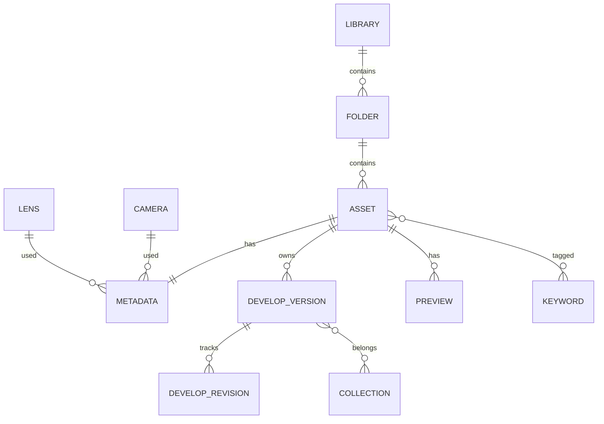

# Catalog Schema Specification

**Document:** `docs/catalog.md`
**Version:** 2.3
**Status:** Draft

---

# 1. Purpose

Le catalogue est le cœur de Leyline.

Il ne stocke **jamais** les photographies.

Il stocke uniquement :

* les références vers les fichiers ;
* les métadonnées ;
* les informations de classement ;
* les paramètres de développement ;
* les collections ;
* les mots-clés ;
* l'historique des développements ;
* les informations nécessaires à la recherche.

Le moteur RAW reste totalement indépendant du catalogue.

---

# 2. Design Principles

## 2.1 Local First

Le catalogue fonctionne entièrement hors ligne.

Une bibliothèque est autonome.

---

## 2.2 Non-destructive

Les RAW ne sont jamais modifiés.

Toutes les opérations sont enregistrées dans le catalogue.

---

## 2.3 Relative Paths

Aucun chemin absolu n'est enregistré.

Toutes les références sont relatives à la racine de la bibliothèque.

Exemple :

```
Library/

    catalog.db

    Photos/

        Wildlife/

            IMG_0001.CR3
```

Le catalogue stocke :

```
Photos/Wildlife/IMG_0001.CR3
```

Jamais :

```
C:\Users\...

/home/quentin/...
```

Cette règle garantit la portabilité entre Windows, Linux et macOS.

---

## 2.4 Source of Truth

Le catalogue SQLite est la seule source de vérité.

Les fichiers XMP sont des exports optionnels ; ils peuvent **amorcer** un catalogue vide à l'import mais n'ont d'autorité sur rien (§29, [ADR 0047](adr/0047-xmp-sidecar-read.md)).

---

# 3. Physical Layout

```
Library/

│

├── catalog.db

├── Photos/

├── Cache/

│      ├── previews/

│      ├── thumbnails/

│      └── histograms/

├── Profiles/

│      └── Camera/          (profils DCP importés, ADR 0035)

├── Exports/

└── Backups/
```

Les aperçus, histogrammes et miniatures ne sont jamais stockés dans SQLite.

SQLite ne contient que leurs métadonnées.

---

# 4. High Level Model



---

# 5. Entity Overview

Le modèle repose sur une notion centrale :

**Asset**

Un Asset représente un fichier géré par Leyline.

Aujourd'hui :

* RAW
* JPEG
* TIFF
* PNG
* DNG
* HEIF

Demain :

* PSD
* OpenEXR
* formats futurs

Le catalogue n'est donc pas limité aux RAW.

---

# 6. Database Configuration

Chaque connexion SQLite doit appliquer :

```sql
PRAGMA foreign_keys = ON;

PRAGMA journal_mode = WAL;

PRAGMA synchronous = NORMAL;

PRAGMA temp_store = MEMORY;

PRAGMA cache_size = -65536;
```

Le schéma est versionné via :

```sql
PRAGMA user_version;
```

Le numéro de version du catalogue n'est jamais stocké dans une table.

SQLite fournit déjà ce mécanisme.

---

# 7. Library

Une seule ligne.

```sql
CREATE TABLE library (

    id INTEGER PRIMARY KEY,

    uuid TEXT NOT NULL UNIQUE,

    name TEXT NOT NULL,

    created_at INTEGER NOT NULL,

    updated_at INTEGER NOT NULL

);
```

Les dates sont exprimées en :

* UTC
* Unix Epoch
* millisecondes

Seule exception : `capture_date`, dont la sémantique est précisée en §9 — l'EXIF n'indique pas toujours le fuseau horaire de la prise de vue.

---

# 8. Folders

```sql
CREATE TABLE folders (

    id INTEGER PRIMARY KEY,

    parent_id INTEGER NULL,

    relative_path TEXT NOT NULL UNIQUE,

    created_at INTEGER NOT NULL,

    FOREIGN KEY(parent_id)

        REFERENCES folders(id)

        ON DELETE RESTRICT

);
```

Les dossiers représentent uniquement l'arborescence physique.

Ils ne contiennent aucune information métier.

---

# 9. Assets

La table principale.

```sql
CREATE TABLE assets (

    id INTEGER PRIMARY KEY,

    uuid TEXT NOT NULL UNIQUE,

    folder_id INTEGER NOT NULL,

    filename TEXT NOT NULL,

    extension TEXT NOT NULL,

    media_type INTEGER NOT NULL,

    file_size INTEGER NOT NULL,

    checksum BLOB NOT NULL,

    width INTEGER,

    height INTEGER,

    capture_date INTEGER,

    capture_offset_minutes INTEGER,

    imported_at INTEGER NOT NULL,

    modified_at INTEGER NOT NULL,

    is_missing INTEGER NOT NULL DEFAULT 0,

    UNIQUE(folder_id, filename),

    FOREIGN KEY(folder_id)

        REFERENCES folders(id)

        ON DELETE RESTRICT

);
```

## Chemin d'un asset

Le chemin complet est toujours dérivé :

```text
folders.relative_path + "/" + filename
```

Aucune colonne `relative_path` n'existe dans `assets`.

Cela rend toute désynchronisation impossible lors du renommage ou du déplacement d'un dossier.

La contrainte `UNIQUE(folder_id, filename)` garantit qu'un même fichier ne peut être référencé deux fois.

## Capture Date

L'EXIF (`DateTimeOriginal`) exprime une heure **locale**, souvent sans fuseau horaire.

Or le photographe s'attend à retrouver l'heure murale de la prise de vue, pas une heure convertie.

Convention :

* `capture_offset_minutes` **connu** (EXIF `OffsetTimeOriginal`, ou GPS) : `capture_date` contient le véritable instant UTC ; l'affichage applique l'offset pour retrouver l'heure locale.
* `capture_offset_minutes` **NULL** : l'heure murale EXIF est stockée telle quelle, interprétée comme UTC. L'affichage la restitue sans conversion.

Cette colonne a un producteur depuis [ADR 0056](adr/0056-non-raw-exif-import.md) : l'import d'un fichier **non-RAW** lit `OffsetTimeOriginal` quand il est présent et renseigne alors les deux colonnes ensemble. Le chemin RAW, lui, ne fournit pas d'offset et laisse la colonne NULL — deuxième cas ci-dessus.

Dans les deux cas :

* le tri chronologique utilise `capture_date` directement ;
* l'heure affichée correspond toujours à celle que le photographe a vue sur son boîtier ;
* si un offset devient connu après coup (correction manuelle, GPS), la mise à jour est sans perte.

## Un asset est purement factuel

La table `assets` ne contient que des faits sur le fichier : chemin, taille, checksum, dimensions, dates.

Le classement (note, label, pick) appartient aux **versions de développement** (§18).

## Versions virtuelles

Il n'existe pas de ligne `assets` pour les versions virtuelles.

Une version virtuelle est une **branche de développement** (voir §16).

Un asset représente toujours un fichier physique unique.

---

# 10. Asset Types

```text
0 RAW

1 JPEG

2 TIFF

3 PNG

4 DNG

5 HEIF

6 PSD

7 OTHER
```

---

# 11. Pick State

```text
0 None

1 Pick

2 Reject
```

Pick et Reject sont portés par les **versions de développement** (§18), comme la note et le label : chaque version est classée indépendamment, à la manière des copies virtuelles de Lightroom.

---

# 12. Checksums

Tous les checksums utilisent :

```
BLAKE3
```

Pourquoi ?

* extrêmement rapide
* cryptographiquement fiable
* implémentation Rust de référence
* meilleur compromis performances / sécurité

Le checksum porte sur le fichier complet.

---

# 13. Metadata

Les métadonnées sont séparées des assets afin de conserver la table principale compacte et optimisée pour les recherches fréquentes.

`gps_latitude`/`gps_longitude`/`gps_altitude` sont peuplées à l'import pour les fichiers RAW dont l'appareil a enregistré une position (LibRaw `parsed_gps`, degrés décimaux) — voir `docs/adr/0040-gps-map-view.md` pour la vue carte qui les consomme (`Catalog::map_pins`). Les JPEG/TIFF n'ont pour l'instant aucune extraction EXIF (caméra, objectif compris) : même limite préexistante que le reste de cette table, pas une régression du GPS spécifiquement.

```sql
CREATE TABLE metadata (

    asset_id INTEGER PRIMARY KEY,

    camera_id INTEGER,

    lens_id INTEGER,

    orientation INTEGER,

    iso INTEGER,

    shutter_numerator INTEGER,

    shutter_denominator INTEGER,

    aperture_numerator INTEGER,

    aperture_denominator INTEGER,

    focal_length_numerator INTEGER,

    focal_length_denominator INTEGER,

    shutter_speed_s REAL GENERATED ALWAYS AS
        (CAST(shutter_numerator AS REAL) / shutter_denominator) STORED,

    aperture_f REAL GENERATED ALWAYS AS
        (CAST(aperture_numerator AS REAL) / aperture_denominator) STORED,

    focal_length_mm REAL GENERATED ALWAYS AS
        (CAST(focal_length_numerator AS REAL) / focal_length_denominator) STORED,

    exposure_bias REAL,

    flash INTEGER,

    white_balance_mode INTEGER,

    color_space TEXT,

    gps_latitude REAL,

    gps_longitude REAL,

    gps_altitude REAL,

    artist TEXT,

    copyright TEXT,

    FOREIGN KEY(asset_id)
        REFERENCES assets(id)
        ON DELETE CASCADE,

    FOREIGN KEY(camera_id)
        REFERENCES cameras(id)
        ON DELETE RESTRICT,

    FOREIGN KEY(lens_id)
        REFERENCES lenses(id)
        ON DELETE RESTRICT

);
```

---

## Pourquoi des fractions ?

Les EXIF stockent généralement :

* vitesse
* ouverture
* focale

sous forme de rationnels.

Exemple :

```text
1/3200

f/5.6

70/1
```

Stocker directement ces valeurs évite les pertes de précision liées aux nombres flottants.

Le moteur convertira ensuite ces valeurs en `f64` lorsque nécessaire.

---

## Colonnes générées

Les rationnels sont la référence, mais ils sont inutilisables pour les recherches par plage (« focale entre 24 et 70 mm »).

Les colonnes générées (`shutter_speed_s`, `aperture_f`, `focal_length_mm`) fournissent la valeur décimale, calculée par SQLite lui-même (≥ 3.31), stockée et indexable.

Les dénominateurs doivent être strictement positifs ; un rationnel absent laisse la colonne générée à `NULL`.

---

# 14. Cameras

```sql
CREATE TABLE cameras (

    id INTEGER PRIMARY KEY,

    manufacturer TEXT NOT NULL,

    model TEXT NOT NULL,

    UNIQUE(manufacturer, model)

);
```

---

# 15. Lenses

```sql
CREATE TABLE lenses (

    id INTEGER PRIMARY KEY,

    manufacturer TEXT NOT NULL,

    model TEXT NOT NULL,

    mount TEXT,

    UNIQUE(manufacturer, model)

);
```

---

# 16. Development Model

Contrairement à Lightroom, les réglages ne sont jamais écrasés.

Le modèle est directement inspiré de Git.

* Une **révision** est un état complet et immuable des réglages (un commit).
* Les révisions forment un graphe orienté via `parent_revision_id`.
* Une **version** est une branche : un nom + un pointeur vers une révision de tête.
* La **version courante** d'un asset désigne la branche active.

```text
RAW

↓

Revision 1 ── Revision 2 ── Revision 3      ← version "Default"
                    │
                    └────── Revision 4      ← version "Noir & Blanc"
```

Cette architecture donne :

* Undo gratuit : reculer le pointeur de tête ;
* Redo gratuit : l'avancer ;
* Historique complet : les révisions ne sont jamais supprimées ;
* Snapshots : n'importe quelle révision peut être nommée ;
* **Versions virtuelles : une simple branche partant d'une révision existante.**

Aucune duplication de fichier, aucune ligne supplémentaire dans `assets`.

## La version est l'unité de bibliothèque

La grille affiche des **versions**, pas des fichiers.

Chaque version porte son propre classement :

* note ;
* label couleur ;
* pick / reject ;
* appartenance aux collections.

Noter une photo « simple » revient à noter sa version `Default`.

Les **mots-clés restent au niveau de l'asset** : ils décrivent le contenu de l'image, identique pour toutes les versions (un héron en noir et blanc reste un héron).

La ligne de partage est simple :

```text
Fait sur l'image      → asset      (mots-clés, EXIF, checksum)

Jugement sur un rendu → version    (note, label, pick, collections)
```

Cas limite connu : un recadrage peut changer le contenu visible (le personnage exclu du cadre). Si ce besoin se confirme, une table additive `version_keywords` permettra d'ajouter ou de masquer des mots-clés **par version**, sans toucher à `asset_keywords` (voir §38).

---

# 17. Develop Revisions

```sql
CREATE TABLE develop_revisions (

    id INTEGER PRIMARY KEY,

    asset_id INTEGER NOT NULL,

    parent_revision_id INTEGER,

    settings_json TEXT NOT NULL,

    author TEXT,

    created_at INTEGER NOT NULL,

    FOREIGN KEY(asset_id)
        REFERENCES assets(id)
        ON DELETE CASCADE,

    FOREIGN KEY(parent_revision_id)
        REFERENCES develop_revisions(id)
        ON DELETE RESTRICT

);
```

`author` est optionnel : il prépare le développement collaboratif (§38) sans rien coûter aujourd'hui.

---

## Coalescence des révisions

Une révision représente une **intention utilisateur**, jamais un événement d'interface.

Un drag de curseur produit des centaines d'événements : il ne doit produire qu'**une seule révision**.

### Points de commit

Le moteur crée une révision uniquement lorsque :

* l'utilisateur relâche un contrôle (fin de drag) ;
* l'utilisateur change d'outil ou de réglage ;
* l'utilisateur change de version ou d'asset ;
* une action explicite l'exige (snapshot, export, synchronisation XMP).

Entre deux points de commit, les valeurs intermédiaires ne vivent qu'en mémoire, pour l'aperçu temps réel.

### Fenêtre d'amendement

Des ajustements successifs du **même réglage** dans une fenêtre courte (2 secondes, configurable) amendent la révision de tête au lieu d'en créer une nouvelle.

L'amendement n'est autorisé que si la révision de tête :

* n'a aucune révision enfant ;
* n'est la tête d'aucune autre version ;
* n'est pas la révision initiale.

C'est la **seule exception** à l'immuabilité des révisions, et elle ne concerne jamais une révision référencée ailleurs.

Un amendement invalide les previews associées à cette révision : leurs lignes sont supprimées, le cache est régénéré.

### Volume

Aucun élagage n'est nécessaire : une révision pèse environ 1 à 2 Ko de JSON.

Une photo lourdement retouchée (50 révisions) coûte moins de 100 Ko — négligeable même sur des centaines de milliers d'assets.

Chaque ligne représente un état complet du développement.

Le JSON est versionné indépendamment afin de permettre son évolution sans migration SQL.

Exemple :

```json
{
    "schema":1,
    "exposure":0.35,
    "contrast":12,
    "temperature":5400,
    "vibrance":18
}
```

Le champ `schema` correspond à la version du format de réglages, **pas** au nombre de modifications.

---

# 18. Versions and Current

## Versions (branches)

```sql
CREATE TABLE develop_versions (

    id INTEGER PRIMARY KEY,

    uuid TEXT NOT NULL UNIQUE,

    asset_id INTEGER NOT NULL,

    name TEXT NOT NULL,

    head_revision_id INTEGER NOT NULL,

    rating INTEGER NULL
        CHECK(rating BETWEEN 1 AND 5),

    color_label INTEGER NULL,

    pick_state INTEGER NOT NULL DEFAULT 0,

    created_at INTEGER NOT NULL,

    UNIQUE(asset_id, name),

    FOREIGN KEY(asset_id)
        REFERENCES assets(id)
        ON DELETE CASCADE,

    FOREIGN KEY(head_revision_id)
        REFERENCES develop_revisions(id)
        ON DELETE RESTRICT

);
```

* Éditer = créer une révision, avancer `head_revision_id`.
* Undo = reculer `head_revision_id` vers la révision parente.
* Créer une version virtuelle = créer une ligne pointant sur une révision existante.

La version porte le classement (`rating`, `color_label`, `pick_state`) : chaque copie virtuelle se note, se labellise et se flagge indépendamment.

```text
rating :       NULL = non noté, 1 à 5 étoiles (la valeur 0 n'existe pas)

color_label :  NULL = aucun label
               0 Rouge, 1 Jaune, 2 Vert, 3 Bleu, 4 Violet
```

## Version courante

```sql
CREATE TABLE develop_current (

    asset_id INTEGER PRIMARY KEY,

    version_id INTEGER NOT NULL,

    FOREIGN KEY(asset_id)
        REFERENCES assets(id)
        ON DELETE CASCADE,

    FOREIGN KEY(version_id)
        REFERENCES develop_versions(id)
        ON DELETE CASCADE

);
```

Changer de version revient simplement à mettre à jour cette référence.

## Révision initiale

À l'import, le moteur crée **obligatoirement** pour chaque asset :

1. une révision initiale (réglages neutres, `parent_revision_id = NULL`) — épinglée comme toute révision stockée (`pipeline.md` §3.3), donc portant déjà la carte `stages` d'une révision neutre. Ces versions d'étages viennent du moteur, jamais du catalogue : `add_asset` reçoit les réglages initiaux de son appelant ;
2. une version par défaut (`Default`) pointant sur cette révision ;
3. l'entrée `develop_current` correspondante.

Un asset possède donc **toujours** au moins une révision et une version.

Cette règle est indispensable : les previews référencent une révision (`NOT NULL`) — sans révision initiale, aucune miniature ne pourrait exister.

---

# 19. Previews

Les aperçus sont des fichiers stockés sur disque.

SQLite ne conserve que leurs métadonnées.

```sql
CREATE TABLE previews (

    id INTEGER PRIMARY KEY,

    asset_id INTEGER NOT NULL,

    revision_id INTEGER NOT NULL,

    kind INTEGER NOT NULL,

    width INTEGER NOT NULL,

    height INTEGER NOT NULL,

    relative_path TEXT NOT NULL,

    generated_at INTEGER NOT NULL,

    UNIQUE(asset_id, revision_id, kind),

    FOREIGN KEY(asset_id)
        REFERENCES assets(id)
        ON DELETE CASCADE,

    FOREIGN KEY(revision_id)
        REFERENCES develop_revisions(id)
        ON DELETE CASCADE

);
```

---

## Preview Kind

```text
0 Thumbnail

1 Small

2 Medium

3 Large

4 Full
```

Chaque niveau correspond à une taille maximale prédéfinie.

Exemple :

| Kind      | Taille max        |
| --------- | ----------------- |
| Thumbnail | 256 px            |
| Small     | 1024 px           |
| Medium    | 2048 px           |
| Large     | 4096 px           |
| Full      | Résolution native |

---

# 20. Cache Invalidation

Un aperçu est considéré comme valide uniquement si :

```text
preview.revision_id == head_revision_id de la version courante
```

Un undo qui ramène la tête sur une révision déjà prévisualisée revalide automatiquement les anciens aperçus : aucune régénération n'est nécessaire.

Dans tous les autres cas :

* aperçu obsolète ;
* régénération automatique.

Aucun timestamp ni hash supplémentaire n'est nécessaire.

La comparaison d'identifiants suffit.

---

# 21. Cache Layout

```text
Cache/

    previews/

        1/

        2/

        3/

    thumbnails/

    histograms/
```

L'organisation physique du cache est indépendante du catalogue.

Il peut être supprimé intégralement sans perte de données.

Le moteur le reconstruira automatiquement.

---

# 22. Keywords

Les mots-clés sont hiérarchiques dès la première version.

Cela évite toute migration complexe ultérieure et permet une organisation similaire à Lightroom, Capture One ou Photo Mechanic.

```sql
CREATE TABLE keywords (

    id INTEGER PRIMARY KEY,

    parent_id INTEGER,

    name TEXT NOT NULL,

    path TEXT NOT NULL UNIQUE,

    created_at INTEGER NOT NULL,

    FOREIGN KEY(parent_id)
        REFERENCES keywords(id)
        ON DELETE RESTRICT

);
```

---

## Exemple

```text
Nature
├── Birds
│   ├── Heron
│   ├── Eagle
│   └── Owl
└── Mammals
    ├── Fox
    └── Deer
```

En base :

```text
Nature

Nature/Birds

Nature/Birds/Heron

Nature/Birds/Eagle

Nature/Mammals/Fox
```

Le champ `path` permet :

* recherches rapides ;
* reconstruction de l'arbre ;
* export XMP simplifié.

---

# 23. Asset Keywords

Relation N:N.

```sql
CREATE TABLE asset_keywords (

    asset_id INTEGER NOT NULL,

    keyword_id INTEGER NOT NULL,

    PRIMARY KEY(asset_id, keyword_id),

    FOREIGN KEY(asset_id)
        REFERENCES assets(id)
        ON DELETE CASCADE,

    FOREIGN KEY(keyword_id)
        REFERENCES keywords(id)
        ON DELETE RESTRICT

);
```

---

# 24. Collections

Les collections sont indépendantes de l'arborescence physique.

Une collection contient des **versions de développement** : on place *la version noir & blanc* dans un album, et c'est elle qui s'affiche et s'exporte.

Une même version peut appartenir à plusieurs collections.

```sql
CREATE TABLE collections (

    id INTEGER PRIMARY KEY,

    uuid TEXT NOT NULL UNIQUE,

    parent_collection_id INTEGER,

    name TEXT NOT NULL,

    description TEXT,

    collection_type INTEGER NOT NULL,

    rules_json TEXT,

    created_at INTEGER NOT NULL,

    FOREIGN KEY(parent_collection_id)
        REFERENCES collections(id)
        ON DELETE RESTRICT

);
```

---

## Collection Types

```text
0 Manual

1 Smart
```

Une collection manuelle contient une liste explicite d'assets.

Une collection intelligente est générée automatiquement à partir de règles.

---

## Renommer, déplacer, supprimer

Une collection est un rangement, pas une donnée : les trois opérations qui la
gèrent ne touchent **jamais** une version, une révision ou un fichier.

* **Renommer** change `name`, rien d'autre. Un nom vide est refusé ; les noms
  ne sont pas uniques (deux albums « Portraits » sous deux parents différents
  sont légitimes, et sous le même parent c'est le problème de l'utilisateur,
  pas une erreur du catalogue).
* **Déplacer** change `parent_collection_id` — la racine étant `NULL`. Un
  déplacement qui ferait d'une collection sa propre descendante est **refusé** :
  l'arbre resterait cohérent pour SQLite, mais le sous-arbre déplacé
  disparaîtrait de toute lecture partant de la racine.
* **Supprimer** emporte le **sous-arbre entier**, du bas vers le haut — la
  clé étrangère `parent_collection_id` est `ON DELETE RESTRICT`, un parent ne
  peut donc pas partir avant ses enfants. Chaque suppression n'entraîne que la
  disparition des appartenances (`collection_versions`, `ON DELETE CASCADE`),
  conformément à l'invariant §29 : *les collections supprimées entraînent
  uniquement la suppression des relations, jamais des versions ni des assets*.
  Le nombre de collections qu'un ordre de suppression emporte est connu avant
  de l'exécuter, pour que l'interface puisse le dire.

---

# 25. Collection Versions

```sql
CREATE TABLE collection_versions (

    collection_id INTEGER NOT NULL,

    version_id INTEGER NOT NULL,

    position INTEGER NOT NULL,

    PRIMARY KEY(collection_id, version_id),

    FOREIGN KEY(collection_id)
        REFERENCES collections(id)
        ON DELETE CASCADE,

    FOREIGN KEY(version_id)
        REFERENCES develop_versions(id)
        ON DELETE CASCADE

);
```

Le champ `position` conserve l'ordre défini par l'utilisateur.

---

# 26. Smart Collections

Les critères sont stockés sous forme JSON.

Exemple :

```json
{
  "rating": {
    "gte": 4
  },
  "camera": "Canon EOS R5",
  "keywords": [
    "Nature/Birds"
  ],
  "pick": true
}
```

Le moteur traduit ensuite ces règles en requêtes SQL optimisées.

Le format JSON est volontairement versionnable.

---

# 27. Export Presets

```sql
CREATE TABLE export_presets (

    id INTEGER PRIMARY KEY,

    uuid TEXT NOT NULL UNIQUE,

    name TEXT NOT NULL,

    settings_json TEXT NOT NULL,

    created_at INTEGER NOT NULL

);
```

Les presets sont indépendants des exports réalisés.

---

# 28. Export History

```sql
CREATE TABLE export_history (

    id INTEGER PRIMARY KEY,

    asset_id INTEGER NOT NULL,

    preset_id INTEGER,

    format TEXT NOT NULL,

    destination TEXT NOT NULL,

    exported_at INTEGER NOT NULL,

    FOREIGN KEY(asset_id)
        REFERENCES assets(id)
        ON DELETE CASCADE,

    FOREIGN KEY(preset_id)
        REFERENCES export_presets(id)
        ON DELETE SET NULL

);
```

L'historique permet de reproduire un export ou d'identifier rapidement la dernière destination utilisée.

---

# 29. XMP Sidecars

Le catalogue reste toujours la source de vérité.

Les fichiers XMP sont optionnels.

Trois modes seront proposés :

```text
Never

On Demand

Always
```

## Never

Aucun fichier XMP n'est généré.

Toutes les informations résident uniquement dans le catalogue.

## On Demand

L'utilisateur déclenche explicitement une synchronisation.

## Always

Chaque modification valide automatiquement le sidecar correspondant.

Ces trois modes concernent l'**écriture** seule.

## Lecture

Le moteur lit un sidecar pour **amorcer** ce que le catalogue n'a pas encore, jamais pour arbitrer ce qu'il a déjà ([ADR 0047](adr/0047-xmp-sidecar-read.md)). Le catalogue reste donc la seule source de vérité (§2.4) : un sidecar n'a d'autorité sur aucun champ déjà renseigné, et rien ne le relit après coup.

Deux moments, et deux seulement :

* **à l'import**, automatiquement, si un `.xmp` se trouve à côté du fichier source — c'est le chemin de migration depuis un autre logiciel, celui qui fait suivre des années de notes, de libellés et de mots-clés hiérarchiques ;
* **explicitement**, sur un asset déjà importé (`read_xmp`), pour une bibliothèque constituée avant l'export des sidecars.

La politique est de **remplir sans écraser** : note, libellé, artiste et copyright ne sont appliqués que là où le catalogue est vide, et les mots-clés sont une union. Aucune lecture ne peut retirer ni remplacer une donnée du catalogue. Il n'y a pas d'équivalent du mode *Always* en lecture — ce serait un second canal d'autorité, donc la fin de §2.4.

Les champs lus sont exactement ceux qu'écrit §29 ci-dessus. Les réglages de développement (`crs:` d'Adobe) ne sont **pas** lus : ils ne sont pas traduisibles vers notre pipeline, et prétendre les reprendre serait mentir sur le rendu.

Le reste sert uniquement à l'interopérabilité avec d'autres logiciels.

---

# 30. Search Philosophy

Toutes les recherches doivent être exécutables directement par SQLite.

Aucun index externe n'est prévu.

Les recherches doivent permettre notamment :

* nom de fichier ;
* date de prise de vue ;
* appareil ;
* objectif ;
* ISO ;
* focale ;
* ouverture ;
* vitesse ;
* note ;
* couleur ;
* Pick / Reject ;
* collections ;
* mots-clés ;
* texte libre ;
* GPS.

L'objectif est de conserver une base légère et autonome.

---

## Texte libre : FTS5

Un `LIKE '%texte%'` ne peut utiliser aucun index.

La recherche en texte libre repose sur **FTS5**, le moteur de recherche plein texte intégré à SQLite — aucun index externe, la règle est respectée.

```sql
CREATE VIRTUAL TABLE search_index USING fts5(

    asset_id UNINDEXED,

    filename,

    keywords,

    artist,

    copyright,

    tokenize = "unicode61 remove_diacritics 2"

);
```

* `remove_diacritics 2` : « héron » et « heron » donnent le même résultat.
* Le contenu est maintenu par le moteur à chaque modification (import, mots-clés, métadonnées).
* `search_index` est reconstructible à tout moment depuis les tables sources : en cas de doute, il se régénère comme un cache.
* Les futures annotations et légendes (§38) s'ajouteront comme simples colonnes FTS.

---

# 31. Integrity Rules

Les règles suivantes sont considérées comme fondamentales.

* Aucun asset ne peut exister sans dossier.
* Aucune métadonnée sans asset.
* Aucune révision sans asset.
* Aucune preview sans révision.
* Chaque asset possède au moins une révision et une version, créées à l'import.
* Une version référence toujours une révision existante.
* Une version virtuelle est une branche de développement, jamais une ligne `assets`.
* Les mots-clés ne sont jamais supprimés automatiquement s'ils sont encore utilisés.
* Les collections supprimées entraînent uniquement la suppression des relations, jamais des versions ni des assets.
* Le classement (note, label, pick) vit exclusivement au niveau des versions.
* Le cache peut être supprimé sans impact sur le catalogue.

Ces règles garantissent la cohérence de la bibliothèque quelles que soient les opérations réalisées.

---

# 32. Index Strategy

Les index sont définis uniquement sur des colonnes appartenant à une même table.

## Assets

```sql
CREATE INDEX idx_assets_capture_date
ON assets(capture_date);

CREATE INDEX idx_assets_folder
ON assets(folder_id);
```

La contrainte `UNIQUE(folder_id, filename)` sert également d'index de chemin.

---

## Metadata

```sql
CREATE INDEX idx_metadata_camera
ON metadata(camera_id);

CREATE INDEX idx_metadata_lens
ON metadata(lens_id);

CREATE INDEX idx_metadata_iso
ON metadata(iso);

CREATE INDEX idx_metadata_focal
ON metadata(focal_length_mm);

CREATE INDEX idx_metadata_aperture
ON metadata(aperture_f);

CREATE INDEX idx_metadata_shutter
ON metadata(shutter_speed_s);
```

Les index portent sur les colonnes générées : ce sont elles que les recherches par plage utilisent, jamais les rationnels bruts.

---

## Keywords

```sql
CREATE INDEX idx_keywords_parent
ON keywords(parent_id);

CREATE INDEX idx_keywords_path
ON keywords(path);
```

---

## Collections

```sql
CREATE INDEX idx_collection_parent
ON collections(parent_collection_id);

CREATE INDEX idx_collection_versions_position
ON collection_versions(collection_id, position);
```

---

## Development

```sql
CREATE INDEX idx_develop_asset
ON develop_revisions(asset_id);

CREATE INDEX idx_develop_parent
ON develop_revisions(parent_revision_id);

CREATE INDEX idx_develop_versions_asset
ON develop_versions(asset_id);

CREATE INDEX idx_develop_versions_rating
ON develop_versions(rating);

CREATE INDEX idx_develop_versions_color
ON develop_versions(color_label);

CREATE INDEX idx_develop_versions_pick
ON develop_versions(pick_state);
```

Le classement étant porté par les versions, les index de tri et de filtrage de la grille vivent sur `develop_versions`.

---

# 33. Deletion Rules

Les règles de suppression sont volontairement strictes.

| Entité          | Règle                                                    |
| --------------- | -------------------------------------------------------- |
| Folder          | RESTRICT                                                 |
| Asset           | CASCADE vers metadata, versions, révisions, previews     |
| Develop Version | CASCADE vers develop_current et collection_versions      |
| Camera          | RESTRICT                                                 |
| Lens            | RESTRICT                                                 |
| Keyword         | RESTRICT si utilisée                                     |
| Collection      | CASCADE vers collection_versions                         |
| Export Preset   | SET NULL dans export_history                             |

Le catalogue ne doit jamais perdre de données silencieusement.

---

# 34. Migration Strategy

Les migrations sont incrémentales.

Chaque changement augmente :

```sql
PRAGMA user_version;
```

Exemple :

```text
Version 1

↓

Version 2

↓

Version 3
```

Une migration :

* n'efface jamais les données ;
* est transactionnelle ;
* peut être rejouée une seule fois.

Toutes les migrations sont stockées dans le dépôt Git.

---

# 35. Performance Strategy

Le catalogue est optimisé pour trois opérations principales.

## Import

Objectif :

* plusieurs milliers de photos par minute.

Optimisations :

* transaction unique ;
* statements préparés ;
* WAL.

---

## Navigation

Objectif :

défilement instantané dans plusieurs centaines de milliers d'assets.

La grille énumère les **versions** : une seule jointure 1:1 indexée (`develop_versions JOIN assets`) fournit classement, chemin et dimensions.

Au-delà de cette jointure, les requêtes courantes évitent toute jointure supplémentaire.

---

## Recherche

Toutes les recherches passent exclusivement par SQLite.

Aucun moteur externe (Lucene, Elasticsearch...) n'est prévu.

SQLite est largement suffisant pour la taille cible du catalogue.

---

# 36. Cache Philosophy

Le cache n'est jamais considéré comme une donnée métier.

Il peut être supprimé à tout moment.

Sont considérés comme du cache :

* miniatures ;
* previews ;
* histogrammes ;
* rendus intermédiaires.

Le moteur est responsable de leur reconstruction.

---

# 37. Backup Strategy

Une bibliothèque est entièrement contenue dans un dossier.

```text
Library/

    catalog.db

    Photos/

    Cache/

    Exports/
```

Une sauvegarde consiste simplement à copier ce dossier.

Les restaurations ne nécessitent aucune opération spécifique.

---

# 38. Future Extensions

Le schéma est conçu pour intégrer sans rupture :

* HDR
* Focus Stacking
* Panorama
* Mots-clés par version (`version_keywords` : ajout ou masquage de mots-clés sur une version précise, en complément d'`asset_keywords`, jamais en remplacement)
* Géolocalisation avancée
* Détection locale des visages
* IA locale
* OCR
* Plugins
* Formats RAW futurs
* Développement collaboratif (optionnel)
* Synchronisation entre bibliothèques

Aucune de ces évolutions ne doit nécessiter une refonte complète du modèle relationnel.

---

# 39. Guiding Principles

Le catalogue suit quelques principes simples.

## Simplicité

Chaque table possède une responsabilité unique.

---

## Cohérence

Toutes les relations sont protégées par des clés étrangères.

---

## Portabilité

Une bibliothèque doit fonctionner sans modification sous Windows, Linux et macOS.

---

## Pérennité

Le schéma doit rester compatible pendant de nombreuses années grâce aux migrations incrémentales.

---

## Performance

Les opérations les plus fréquentes (navigation, recherche, développement) doivent rester fluides même avec plusieurs centaines de milliers d'assets.

---

# 40. Summary

Le catalogue Leyline est conçu comme un **Digital Asset Manager (DAM)** moderne :

* SQLite comme unique base de données ;
* chemins relatifs pour une portabilité totale ;
* architecture **Asset** plutôt que **Photo** ;
* développement non destructif inspiré de Git : révisions immuables, versions = branches ;
* versions virtuelles = simples branches de développement, sans duplication ;
* la version comme unité de bibliothèque : note, label, pick et collections par version ;
* mots-clés au niveau de l'asset : ils décrivent le contenu, commun à toutes les versions ;
* hiérarchie native des mots-clés ;
* collections manuelles et intelligentes ;
* cache entièrement régénérable ;
* révisions coalescées : une révision = une intention, jamais un événement d'interface ;
* recherche plein texte via FTS5, intégrée à SQLite ;
* heure de prise de vue fidèle à l'heure locale du boîtier, offset stocké séparément ;
* XMP optionnels, le catalogue restant la source de vérité ;
* contraintes d'intégrité strictes et migrations versionnées.

L'objectif est de fournir un catalogue robuste, performant et extensible, capable d'accompagner l'évolution de Leyline pendant de nombreuses années sans remise en cause de son architecture fondamentale.

---

# 41. Develop Presets

```sql
CREATE TABLE develop_presets (

    id INTEGER PRIMARY KEY,

    uuid TEXT NOT NULL UNIQUE,

    name TEXT NOT NULL,

    preset_json TEXT NOT NULL,

    created_at INTEGER NOT NULL

);
```

Presets de développement (`docs/presets.md`) : un jeu **partiel** de réglages, jamais un `settings_json` complet (§17). Le catalogue traite `preset_json` comme une chaîne opaque, au même titre qu'`export_presets.settings_json` (§27) — c'est le moteur (`leyline-core::PresetSettings`) qui en interprète la structure.

Depuis [ADR 0058](adr/0058-preset-provenance-and-shelf.md), une révision produite par l'application d'un preset **enregistre lequel**, et dans quelle version de ce preset (`develop_revisions.from_preset_id`, `from_preset_revision`) — ce qui permet de répondre à « quelles photos ont été développées avec celui-ci, et lesquelles avec une version antérieure ? ».

Cela n'écorne pas la règle de §17. Ce qui reste vrai, et qui est l'essentiel :

* **les réglages d'une révision restent un état**, jamais un journal : la provenance vit dans deux colonnes que le moteur de rendu ne lit **jamais**, et rien n'en entre dans `settings_json` (ADR 0058 §5) ;
* **renommer, modifier ou supprimer un preset n'a aucun effet rétroactif** : les révisions déjà écrites gardent leurs réglages et donc leurs pixels. Une suppression met simplement la référence à `NULL` (`ON DELETE SET NULL`), elle n'efface pas la révision.

Un preset porte aussi son rangement (`folder_id`, `favourite`) et son compteur de version (`preset_revision`, incrémenté à chaque modification).

```sql
CREATE TABLE preset_folders (

    id INTEGER PRIMARY KEY,

    name TEXT NOT NULL,

    created_at INTEGER NOT NULL

);
```

Un seul niveau de dossiers (ADR 0058 §2) : ils se renomment, se suppriment — leurs presets remontent alors à la racine — et peuvent être vides.

---

# 42. Print Presets (ADR 0036)

```sql
CREATE TABLE print_presets (

    id INTEGER PRIMARY KEY,

    uuid TEXT NOT NULL UNIQUE,

    name TEXT NOT NULL,

    settings_json TEXT NOT NULL,

    created_at INTEGER NOT NULL

);
```

Parallèle exact d'`export_presets` (§27) : `settings_json` est opaque ici aussi, c'est `leyline_export::PrintSettings` qui en interprète la structure (papier, orientation, marges, DPI, profil ICC de destination, intention de rendu).

Contrairement à l'export, l'impression n'a pas de table d'historique : imprimer ne modifie aucune révision et ne produit aucun artefact que le catalogue doive pouvoir retrouver plus tard (ADR 0036) — le fichier PDF rendu est un artefact ponctuel, pas un état à journaliser. Les données de job (quelles versions, combien de copies) ne sont jamais stockées, exactement comme `ExportRequest.versions` reste séparé d'`export_presets`.
