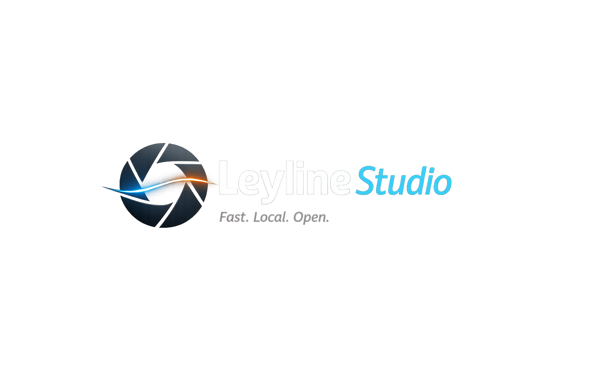

# Leyline

> **Open Source RAW Development Platform**
>
> *Fast. Local. Open.*

Leyline is a RAW photographic development platform: an engine, and the applications built around it.

* **Leyline** — the platform (the repository, the crates, the documentation).
* **Leyline Engine** — the rendering and catalog engine. Independent of any interface.
* **Leyline Studio** — the desktop application. One client of the engine among others, on the same footing as the CLI and the SDK.

The aim is not to reproduce an existing product feature by feature, but to build a platform with no subscription, no cloud and no proprietary format, whose architecture stays maintainable twenty years from now. The *why* is developed in [`vision.md`](vision.md).

---

## Project status — August 2026

**The V1 scope is delivered in full**, on all three clients (Studio, CLI, SDK): import, catalog, thumbnails, EXIF, the complete non-destructive develop pipeline, lens correction, colour management, presets, reprocessing, JPEG/TIFF/WebP/AVIF export, printing, tethering, watched folder, map view, installers and a multilingual interface.

**The seven features scoped for V2 are delivered too** ([`v2-scope.md`](v2-scope.md)): tone curve, spot removal, masked local adjustments and range masks, HSL mixer and colour grading, clarity/texture/dehaze, text watermark and soft proofing, DCP camera profiles (experimental). To which are added edge-preserving denoising, reading XMP sidecars, highlight reconstruction, perspective correction and creative `.cube` LUTs.

Rendering rests on a pipeline of versioned stages ([ADR 0042](adr/0042-versioned-stage-pipeline.md), [ADR 0043](adr/0043-collapse-prerelease-render-history.md)) working in linear wide-gamut light ([ADR 0044](adr/0044-linear-wide-gamut-working-space.md)): that is what carries the reproducibility promise of [`pipeline.md`](pipeline.md) §5.

What remains open:

| Subject | State |
|---|---|
| Colorimetric accuracy of DCP profiles | Not validated against real Adobe `.dcp` files — the feature is flagged as experimental ([ADR 0035](adr/0035-camera-profile-dcp.md)) |
| Local adjustments: range eyedropper, drag handles | Left out of scope by [ADR 0049](adr/0049-local-adjustments-clients.md); the mask overlay itself is delivered ([ADR 0071](adr/0071-mask-overlay.md)) |
| Detected masks | The **socket** is delivered ([ADR 0073](adr/0073-external-mask-detectors.md)): Studio knows how to call an external detector. No detector ships with Leyline, and no model is embedded |
| First publication | No binary published, no version cut |

The rest of the work is robustness, performance and polish, not missing features.

---

## Where to start

**To understand the project** — read in this order, about thirty minutes:

1. [`vision.md`](vision.md) — *why* the project exists, for whom, and what it refuses to be.
2. [`architecture.md`](architecture.md) — *how* it is divided: the crates, their dependencies, the technical choices and their reasons.
3. [`specification.md`](specification.md) — *what*: the delivered scope, and what is deliberately excluded.

**To contribute code** — carry on with:

4. [`contributing.md`](contributing.md) — style, commits, licence, CLA, and the procedure for adding or fixing a render stage.
5. [`pipeline.md`](pipeline.md) — the render contract. To be read **before** touching the engine: it defines what a stage version is and what the project promises about the reproducibility of a render (§5).
6. [`adr/`](adr/README.md) — 79 structural decisions, each with its context, its rejected alternatives and its consequences. That is where the *why* of almost everything surprising in the code lives.

**To integrate the engine** — [`engine-api.md`](engine-api.md), then the `leyline-sdk` crate, which is the stable public surface.

---

## Map of the documentation

**Reading** documents are read end to end. **Reference** documents are consulted: you look for a precise answer in them, you do not read them linearly.

| Document | Answers | Nature |
|---|---|---|
| [`vision.md`](vision.md) | Why this project, for whom, on what principles | Reading |
| [`architecture.md`](architecture.md) | Which crates, which dependencies, which external building blocks | Reading |
| [`specification.md`](specification.md) | What is delivered, what is excluded | Reading |
| [`roadmap.md`](roadmap.md) | Where the project stands, phase by phase | Reading |
| [`contributing.md`](contributing.md) | How to contribute, under which licence, how to touch the pipeline | Reading |
| [`pipeline.md`](pipeline.md) | Order of operations, `settings_json`, stage versions, reproducibility | Reference |
| [`catalog.md`](catalog.md) | The catalog's complete SQLite schema | Reference |
| [`engine-api.md`](engine-api.md) | The engine's Rust surface, execution model, edit sessions | Reference |
| [`presets.md`](presets.md) | Develop presets: model and behaviour | Reference |
| [`system-requirements.md`](system-requirements.md) | What machine Leyline runs on, and from what floor | Reference |
| [`v2-scope.md`](v2-scope.md) | Scoping of post-V1 features | Reference |
| [`v2-implementation-plan.md`](v2-implementation-plan.md) | Recommended sequencing of those features | Reference |
| [`measured-findings.md`](measured-findings.md) | What was measured, what it changed, and what turned out to be wrong | Reference |
| [`adr/`](adr/README.md) | Why one decision rather than another | Reference |

---

## One source per subject

Every subject has **one** owning document, and it alone is authoritative. The others link to it instead of copying — duplicated information always ends up diverging, and the reader then has no way of knowing which copy is current.

Where a document and the code disagree, the document is authoritative: the project's rule is that code follows the specification, and that a deliberate divergence is settled by amending the specification in the same change (plus an ADR if the decision is structural).

---

## Licence

Leyline is published under **GPL-3.0**.

* Engine and application entirely Open Source, offline operation, no licence expiry.
* Commercial licences are planned in time (a dual-licence model, Qt-style); the *community* version stays entirely GPL.
* Contributions are subject to a CLA — see [`contributing.md`](contributing.md) and [ADR 0009](adr/0009-gpl3-cla-dual-license.md).

---

> **No code before architecture. No architecture before vision.**
